# 1. Project Overview

This project is a complete end-to-end data engineering solution for an e-commerce platform that focuses on data maintenance, enrichment, and fraud analysis.

The goal is to design a reliable, scalable, and analytics-ready pipeline that continuously collects, processes, and updates e-commerce data while enabling downstream fraud detection and business insights.

The pipeline handles:

->Ingestion of real-time and historical order and payment data

->Schema validation and deduplication

->Enrichment using dimension tables (customers, products, shipments)

->Creation of layered storage (Bronze → Silver → Gold)

->Automated upserts to MongoDB Atlas for reporting and analysis

# 2. Key Objectives

Build a robust data foundation that can handle schema evolution and maintain latest valid records.

Automate ingestion of orders and payments using NiFi and Kafka (EC2).

Apply transformations, deduplication, and enrichment in PySpark with Delta Lake.

Maintain dimension tables (customers, products, courier partners) with version tracking and upserts.

Store the latest state of all entities in MongoDB Atlas for analytical queries.

Detect and analyze fraudulent patterns like multiple payments, COD abuse, and suspicious IPs.

Build Databricks AI Dashboards to visualize operational insights.

# 3. Architecture Diagram

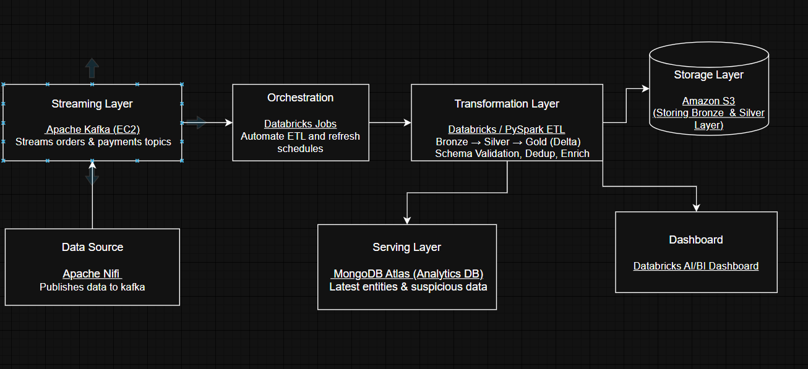

# 4. Tech Stack

1.Ingestion-Apache NiFi(Linux environment)-Publish live data from local to Kafka

2.Streaming Broker-Apache Kafka (EC2)-Handle streaming of order and payment data

3.Storage-Delta Lake / S3-Bronze (raw), Silver (cleaned), Gold (enriched/fraud)

4.Processing-PySpark (Databricks)-Data transformation, validation, enrichment

5.Database-MongoDB Atlas-Stores up-to-date customers, products, and suspicious orders

6.Visualization-Databricks AI Dashboard-Business analytics

7.Orchestration-Databricks Jobs-Automate ETL and refresh schedules

8Language-Python, SQL	Core ETL and query logic

# 5. Data Flow

### Apache Nifi
It is s data ingestion and flow management tool that automates how data moves between systems.
Here it is used to read data from local file system and publish stream to kafka .Below is the structure for orders event where it read data from jsonl files and publish to kafka in a controlled way  

### Bronze Layer
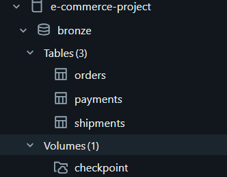

Raw ingestion from Kafka topics.

Unfiltered event data for orders and payments.

Captures all activity including failed transactions and retries.

### Silver Layer
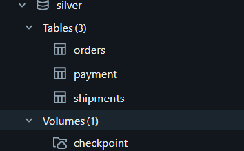

Cleansed and validated data.

Schema consistency checks and deduplication.

Adds derived columns like fraud_score, is_high_value, and event_date.

Enriched with customer and product dimension data.

### Gold Layer
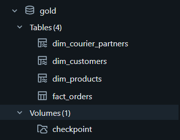

Combines Silver orders, shipments, and Bronze payments for deeper analytics.

Detects anomalies such as:

Multiple payment attempts on same order

Delivery delay breaches

Suspicious IPs or locations

High-value or high-fraud-score orders

Maintains SCD-2 like shown in below:-
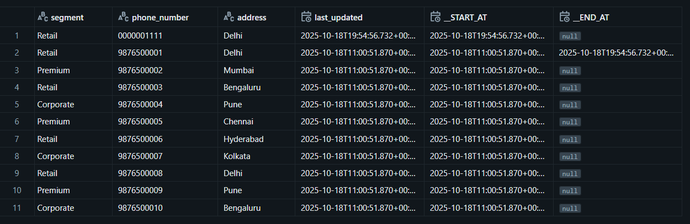

### MongoDB Atlas

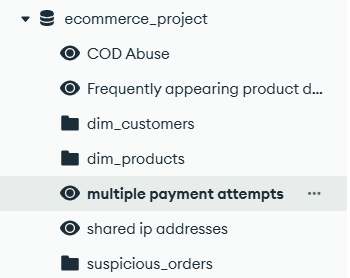

Stores:

dim_customers → Active customers where _END_AT is NULL

dim_products → Current product catalog

suspicious_orders → Orders flagged during fraud detection

COD Abuse (View) → Customers who has cancelled COD orders more than 2 times

Multiple payment attempts (View) → Multiple payments for same order has been done

shared ip addresses (View) → multiple customers using ip address

Upsert logic ensures the database always reflects the latest state.

### Databricks Dashboards

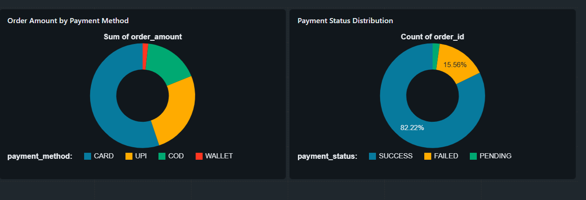

# 6. Orchestration

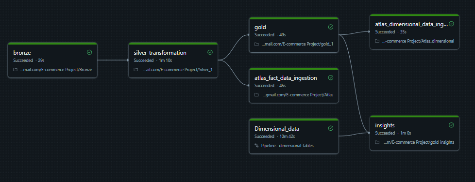

Initiates the job at every hour to make sure up to date data is present in the gold layer for better analytics and fraud detection.

It also initiates the declarative ETL pipeline which maintains the SCD-2 data in dimensional table under gold layer.

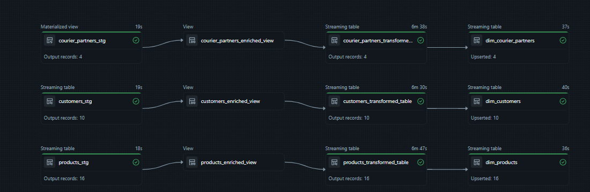 

# 7.Insights

Some of the insights that can be found from the gold layer are:-

### Total Sales by Day and Product Category

### Customer Lifetime Value (LTV)
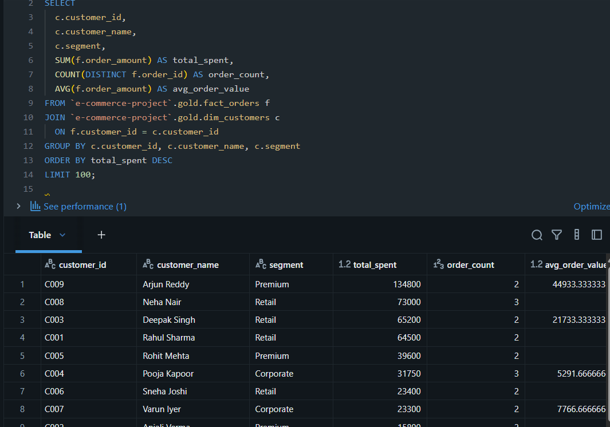

### Payment Method Split & Success Rate
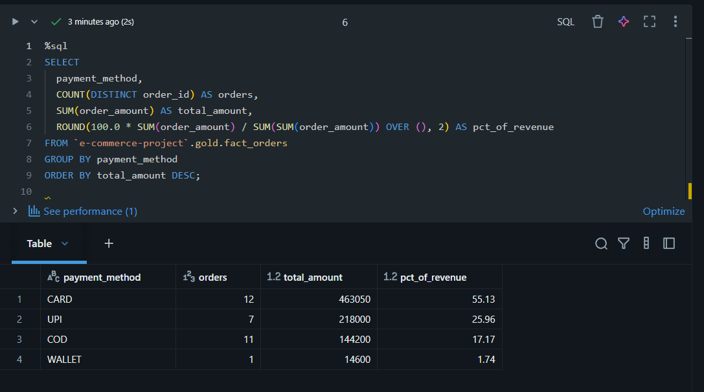

### Courier Performance (Average Delivery Delay)
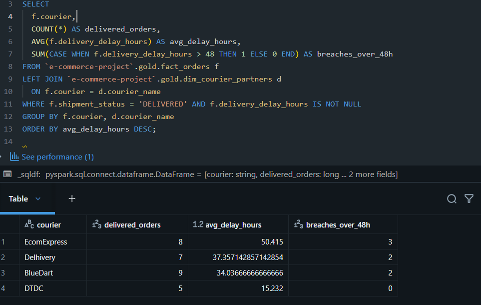

### Order cancellation Rate
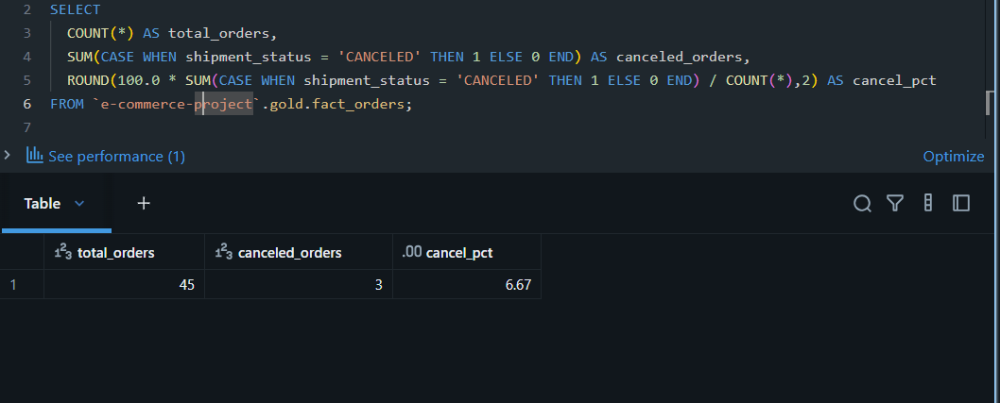

### Orders placed using same ip address

### Multiple payments attempt

### Frequently appearing products

# 8.Features
Handles schema evolution in Delta Lake & SCD-2 data in dimensional tables.

Deduplication logic ensures only latest valid records (_END_AT IS NULL) are used.

Uses bulk upsert to MongoDB Atlas for efficiency.

Partitioning improve read performance.

Modularized PySpark scripts for easier maintenance and testing.

Fault-tolerant and idempotent design with checkpointing in Databricks.

# 9. Future Enhancements

Expand data sources to include returns and refunds pipelines.

Build Superset / Power BI dashboards for advanced reporting.

Implement real-time streaming using databricks paid platform 
